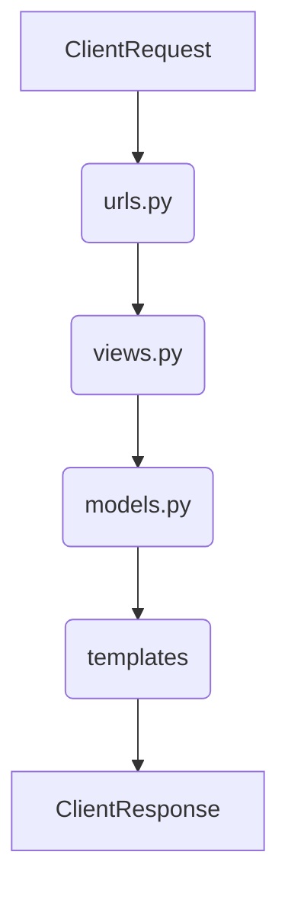
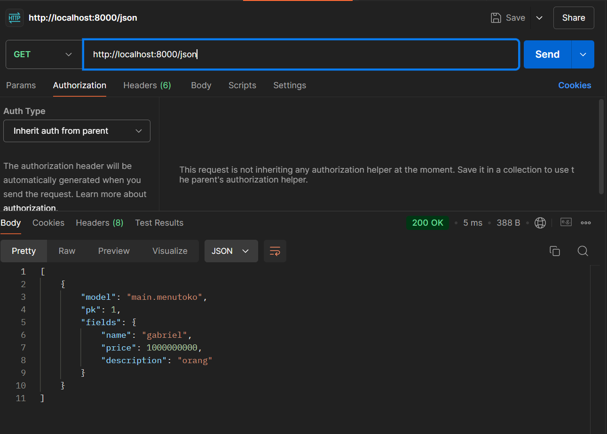
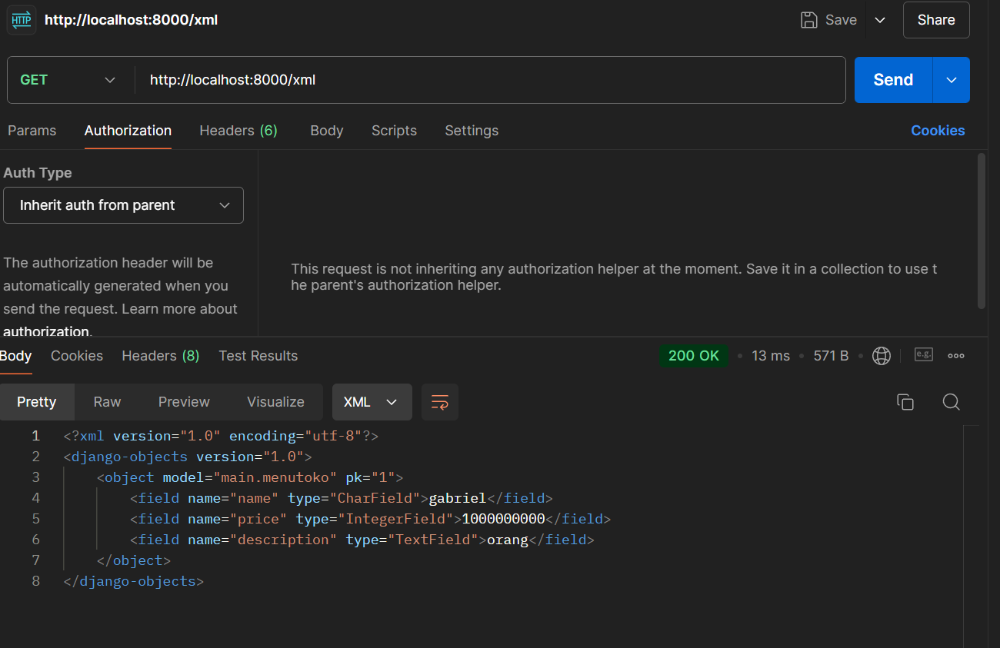

NAMA : Gabriel S. A. Fenanlampir


NPM : 2306315516


JURUSAN : Ilmu komputer 


KELAS : PBP E 


TUGAS 2 : e-shop Alkimia GaVel Shop


link PWS dapat diakses disini: https://gabriel-selwas-tugas2.pbp.cs.ui.ac.id/

Persiapan Lingkungan Pengembangan

Install Python dan pip (Package Installer for Python).
Buat dan aktifkan virtual environment untuk mengisolasi dependensi proyek.
Install Django menggunakan pip: pip install django.
Membuat Proyek Django

Buat proyek baru dengan perintah: django-admin startproject nama_proyek.
Masuk ke direktori proyek dengan cd nama_proyek.
Membuat Aplikasi Django

Buat aplikasi baru dalam proyek dengan perintah: python manage.py startapp nama_aplikasi.
Daftarkan aplikasi di settings.py proyek dengan menambahkannya ke INSTALLED_APPS.
Membuat Model

Definisikan model di models.py dalam aplikasi, misalnya:
```
            <from django.db import models

            <class Artikel(models.Model):
                judul = models.CharField(max_length=100)
                isi = models.TextField()
                tanggal_dibuat = models.DateTimeField(auto_now_add=True)>
                
            <from django.db import models

            <class Artikel(models.Model):
                judul = models.CharField(max_length=100)
                isi = models.TextField()
                tanggal_dibuat = models.DateTimeField(auto_now_add=True)>
```
Migrasi Database

Jalankan perintah python manage.py makemigrations untuk membuat file migrasi.
Terapkan migrasi dengan python manage.py migrate untuk membuat tabel di database.
Membuat View dan URL

Definisikan view di views.py, misalnya:

```
            from django.shortcuts import render
            from .models import Artikel

            def daftar_artikel(request):
                artikel_list = Artikel.objects.all()
                return render(request, 'daftar_artikel.html,{'artikel_list': artikel_list}


            Daftarkan URL di urls.py aplikasi:
            
            <from django.urls import path
            from . import views

            urlpatterns = [
            path('artikel/', views.daftar_artikel, name='daftar_artikel'),
]
```

Buat template HTML di direktori templates, misalnya daftar_artikel.html:

```
                <!DOCTYPE html>
                <html>
                <head>
                    <title>Daftar Artikel</title>
                </head>
                <body>
                    <h1>Daftar Artikel</h1>
                    <ul>
                    
                        <li>{{ artikel.judul }} - {{ artikel.isi }}</li>
                    
                    </ul>
                </body>
                </html>
```

Pengujian dan Deploy

Jalankan server pengembangan dengan python manage.py runserver dan uji aplikasi di browser.
Untuk deployment, gunakan platform seperti Heroku, DigitalOcean, atau lainnya.
*Bagan Arsitektur Web Django*
Berikut adalah bagan sederhana dari request client ke web aplikasi berbasis Django:



Penjelasan:

*urls.py:* Menyediakan rute URL yang mengarahkan request client ke view yang sesuai.


*views.py:* Menangani logika aplikasi, memproses data menggunakan model, dan mengembalikan response dalam bentuk template HTML.


*models.py:* Mengelola data dan interaksi dengan database.


*Templates (HTML):* Menyajikan data yang dikirimkan oleh view dalam format HTML kepada client.


Fungsi Git dalam Pengembangan Perangkat Lunak
Git adalah sistem kontrol versi yang digunakan untuk melacak perubahan dalam kode sumber proyek. Fungsinya mencakup:

                *Versi Kontrol:* Mengelola dan menyimpan versi kode yang berbeda.


                *Kolaborasi:* Memungkinkan banyak developer bekerja pada proyek yang sama secara bersamaan.


                *Branching dan Merging:* Membantu membuat cabang pengembangan terpisah dan menggabungkannya kembali setelah selesai.


                *Histori Perubahan:* Menyimpan riwayat perubahan kode untuk referensi dan pemulihan di masa depan.
                Mengapa Memulai Dengan Django?
                Django adalah framework yang ideal untuk pemula karena:

                        *Dokumentasi Lengkap:* Menyediakan panduan yang komprehensif dan mudah dipahami.
                        *Batteries Included:* Menyediakan banyak fitur bawaan seperti admin panel, autentikasi, dan ORM yang mempermudah pengembangan.
                        *Struktur Proyek Jelas:* Mengikuti prinsip desain yang memudahkan pemahaman alur kerja dan pengembangan aplikasi web.

                        Mengapa Model pada Django Disebut ORM?
                        Model pada Django disebut ORM (Object-Relational Mapping) karena:

                        *Abstraksi Database:* Menghubungkan objek Python dengan tabel database, sehingga developer tidak perlu menulis SQL langsung.
                        *Pengelolaan Data:* Memudahkan operasi CRUD (Create, Read, Update, Delete) dengan menggunakan metode Python standar.
                        *Pemetaan Objek:* Mengonversi data antara format database dan objek Python dengan cara yang transparan.

Q: kenapa kita perlu data delivery dalam mengiplementasi sebuah  pltform?

A: karena 
    1. penyampaian informasi tepat waktu
        ini akan memastikan semua informasi(apapun itu), bisa diakses secara langsung(real-time), berguna untuk pengambilan keputusan cepat dan akurat
    2. konesivitas
        karena platform biasanya terdiri dari banyak komponen, data delivery memungkinkan konektivitas yang baik diantara komponen dan mamstikan bahwa setiap bagian dari platform mendpatkan data yang dibutuhkan.
    3.pengolahan data terdistribusi
        pada platform yang melibatkan terdistribusi, seperti platform berbasis cloud, data delivery sangat penting dalam memastikan sinkronisasi antara berbagai aplikasi. 

Q:  Menurutmu, mana yang lebih baik antara XML dan JSON? Mengapa JSON lebih populer dibandingkan XML?

A:  menurut saya, JSON lebih baik ketimbang XML karena lebih mudah secara penulisan, dan juga punya ukuran data cenderung kecil dibandingkan XML.
alasan mengapa JSON leih populer, karena kesederhanaan dan kemudahan, tentu saja mudah dibaca oleh manusia dan lebih mudah digunakan dalam bahasa pemograman moderen. JSON juga punya kinerha yang baik karena lebih ringan dan lebih cepat untuk di proses. juga JSON lebih populer karena mendapat dukungan luas dari banyak bahasa dan framework yang build-in nya mendukung JSON

Q:  Jelaskan fungsi dari method is_valid() pada form Django dan mengapa kita membutuhkan method tersebut

A:   Method is_valid() pada form Django berfungsi untuk memeriksa apakah data yang dikirimkan melalui form memenuhi semua validasi yang ditentukan. Ini adalah langkah pertama yang harus dilakukan sebelum kita bisa mengakses data yang sudah divalidasi dan diproses melalui form. Jika is_valid() mengembalikan nilai True, artinya data form tersebut valid dan dapat diproses lebih lanjut, seperti disimpan ke database atau digunakan dalam operasi lain.

Q:  Mengapa kita membutuhkan csrf_token saat membuat form di Django? Apa yang dapat terjadi jika kita tidak menambahkan csrf_token pada form Django? Bagaimana hal tersebut dapat dimanfaatkan oleh penyerang?


A: csrf_token di butuhkan untuk melindungi aplikasi dari serangan  CSRF (Cross-Site Request Forgery). CSRF adalah jenis serangan yang mencoba memanipulasi pengguna yang tertautentikasi untuk mengirimkan permintaan palsu ke server tanpa sepengetahuan mereka. tanpa perlindungan ini,aplikasi web menjadi rentan terhadap manipulasi permintaan berbahaya. hal tersebut kemudian memberikan akses atau dimanfaatkan penyerang untuk mengubah data penting dan melakukan transaksi tidak sah dan mengakses data data sensitif.


Q:  Jelaskan bagaimana cara kamu mengimplementasikan checklist di atas secara step-by-step (bukan hanya sekadar mengikuti tutorial).

A: saya mengimplementasinya selain dari tutorial dan juga dari stackoverflow, serta mencari beberapa sumber lain untuk mengimplementasikan checklist






1. Perbedaan antara HttpResponseRedirect() dan redirect():
    HttpResponseRedirect(): Ini adalah kelas bawaan Django yang digunakan untuk melakukan redirect ke URL tertentu. Ketika dipanggil, Anda harus secara eksplisit menentukan URL tujuan dalam bentuk string.
    redirect(): Ini adalah shortcut yang lebih fleksibel dan mudah digunakan. Anda dapat melewatkan argumen seperti URL, nama view, atau bahkan objek model, dan Django akan mengubahnya menjadi URL secara otomatis.

    Perbedaan utama:
    HttpResponseRedirect() hanya menerima URL dalam bentuk string.
    redirect() lebih fleksibel karena bisa menerima nama view atau objek model, yang kemudian akan diubah menjadi URL secara otomatis.


2. Penghubungan Model Product dengan User
    Penghubungan antara model Product dengan User di Django biasanya dilakukan menggunakan relasi ForeignKey. Hal ini berguna untuk menghubungkan produk yang dibuat atau dimiliki oleh seorang pengguna ke tabel User yang disediakan oleh Django's authentication system. contohnya :

        from django.contrib.auth.models import User
        from django.db import models

        class Product(models.Model):
            name = models.CharField(max_length=100)
            price = models.DecimalField(max_digits=10, decimal_places=2)
            owner = models.ForeignKey(User, on_delete=models.CASCADE)

            def __str__(self):
        return self.name


    Dalam contoh di atas:
    Field owner adalah ForeignKey yang menghubungkan model Product dengan model User.
    Dengan on_delete=models.CASCADE, jika pengguna dihapus, semua produk yang terkait dengan pengguna tersebut juga akan dihapus.

    Dalam contoh di atas:
    Field owner adalah ForeignKey yang menghubungkan model Product dengan model User.
    Dengan on_delete=models.CASCADE, jika pengguna dihapus, semua produk yang terkait dengan pengguna tersebut juga akan dihapus.
    Cara kerja:

    Ketika seorang pengguna membuat produk baru, data pengguna akan disimpan di field owner.
    Django akan menjaga integritas relasi ini dengan melakukan operasi seperti cascading delete jika pengguna dihapus.

3. Perbedaan antara Authentication dan Authorization
    Authentication (otentikasi) adalah proses verifikasi identitas pengguna. Biasanya, ini melibatkan pengguna memasukkan kredensial seperti username dan password. Ketika pengguna berhasil diotentikasi, Django akan memastikan bahwa identitas mereka benar.
    Authorization (otorisasi) adalah proses menentukan apakah pengguna yang telah diotentikasi memiliki izin untuk mengakses sumber daya tertentu. Setelah pengguna berhasil diotentikasi, sistem akan memeriksa hak akses mereka terhadap objek atau tindakan tertentu.

    Contoh perbedaan:
    Authentication: "Siapakah Anda?" -> Pengguna memasukkan username dan password.
    Authorization: "Apakah Anda diizinkan mengakses ini?" -> Setelah login, periksa apakah pengguna dapat mengakses halaman tertentu.

    Apa yang terjadi saat login di Django:
    Ketika pengguna login, Django memverifikasi kredensial (username dan password).
    Jika kredensial valid, Django menyimpan status login pengguna di sesi menggunakan mekanisme session dan cookies.

    Implementasi di Django:
    Authentication dilakukan melalui django.contrib.auth yang menyediakan views dan backend otentikasi.
    Authorization dapat dilakukan menggunakan decorators seperti @login_required untuk memverifikasi apakah pengguna sudah login, serta @permission_required untuk memeriksa apakah pengguna memiliki izin tertentu.

4. Bagaimana Django Mengingat Pengguna yang Telah Login
    Django mengingat pengguna yang telah login menggunakan mekanisme session dan cookies.

    Setelah pengguna berhasil login, Django menciptakan sesi untuk pengguna tersebut. Session ID disimpan di browser pengguna dalam bentuk cookie.
    Setiap kali pengguna mengirim permintaan (request), cookie ini dikirim kembali ke server, dan Django menggunakan session ID untuk memulihkan data sesi dari penyimpanan (database atau cache).
    Django juga menyimpan informasi pengguna di session, sehingga aplikasi dapat mengetahui pengguna mana yang sedang aktif.

    Kegunaan lain dari cookies:
    Menyimpan preferensi pengguna: Misalnya, pengaturan tampilan atau bahasa yang dipilih oleh pengguna.
    Menyimpan data keranjang belanja: Situs e-commerce dapat menyimpan barang yang ditambahkan ke keranjang belanja pengguna.
    Pelacakan: Cookies juga digunakan untuk pelacakan sesi pengguna di berbagai halaman, termasuk untuk tujuan analisis atau iklan.

    Keamanan cookies:
    Tidak semua cookies aman: Cookies dapat berpotensi disalahgunakan untuk session hijacking atau serangan cross-site scripting (XSS). Oleh karena itu, penting untuk menggunakan atribut HttpOnly dan Secure pada cookies:
    HttpOnly: Mencegah akses ke cookie dari JavaScript, sehingga meminimalkan risiko serangan XSS.
    Secure: Memastikan cookie hanya dikirim melalui koneksi HTTPS.


    1. Urutan Prioritas CSS Selector
Ketika ada beberapa CSS selector yang diterapkan pada suatu elemen HTML, browser menggunakan urutan prioritas tertentu untuk menentukan mana yang harus digunakan. Urutan prioritas CSS selector berdasarkan "specificity" (keistimewaan) adalah sebagai berikut:

Inline Styles: CSS yang ditulis langsung pada elemen HTML memiliki prioritas tertinggi. Contohnya: <div style="color: red;"></div>.
ID Selector: Selector berbasis ID (#id) memiliki prioritas yang lebih tinggi dibandingkan class, attributes, atau tag selector. Contoh: #header { color: blue; }.
Class, Pseudo-Class, Attribute Selector: Selector berbasis class (.class), pseudo-class (
,
), atau selector berbasis atribut ([type="text"]) memiliki prioritas menengah. Contoh: .menu { color: green; }.
Element (Tag) Selector: Selector berbasis elemen seperti div, p, atau h1 memiliki prioritas terendah. Contoh: p { color: black; }.
Universal Selector: Selector * memiliki prioritas paling rendah dan diterapkan ke semua elemen.
Important Rule: Menggunakan !important di dalam deklarasi akan memaksa CSS tersebut untuk mengesampingkan semua prioritas di atas. Namun, ini sebaiknya digunakan dengan hati-hati.
Urutan prioritas ini bisa dikombinasikan, misalnya selector dengan ID dan class bersamaan akan lebih spesifik daripada hanya menggunakan class saja.

2. Pentingnya Responsive Design dalam Pengembangan Aplikasi Web
Responsive design adalah konsep yang memungkinkan tampilan website dapat menyesuaikan dengan berbagai ukuran layar, dari perangkat mobile hingga desktop. Pentingnya responsive design adalah sebagai berikut:

Pengalaman Pengguna yang Konsisten: Dengan responsive design, pengguna mendapatkan pengalaman yang optimal terlepas dari perangkat yang mereka gunakan, baik itu smartphone, tablet, atau desktop.
SEO (Search Engine Optimization): Google memberikan peringkat lebih tinggi pada website yang mobile-friendly.
Aksesibilitas: Pengguna dapat mengakses konten dengan nyaman tanpa harus melakukan zoom in atau out.
Efisiensi: Menggunakan satu basis kode untuk semua jenis perangkat, alih-alih membuat versi desktop dan mobile yang terpisah.
Contoh aplikasi yang sudah menerapkan responsive design:

Facebook: Tampilan antarmuka dapat menyesuaikan dengan baik di layar smartphone maupun desktop.
Contoh aplikasi yang belum menerapkan responsive design:

Beberapa portal pemerintahan di beberapa negara terkadang belum mendukung responsive design dengan baik, sehingga sulit digunakan pada perangkat mobile.
3. Perbedaan Margin, Border, dan Padding
Dalam CSS box model, margin, border, dan padding memiliki fungsi yang berbeda:

Margin: Ruang kosong di luar border elemen. Margin digunakan untuk memberi jarak antar elemen HTML. Contoh implementasi:
css
Copy code
div {
  margin: 20px;
}
Border: Garis yang mengelilingi konten dan padding dari elemen. Border menambah bingkai di sekitar elemen. Contoh implementasi:
css
Copy code
div {
  border: 2px solid black;
}
Padding: Ruang kosong di dalam elemen, di antara konten dan border. Padding digunakan untuk memberi jarak antara konten dan tepi elemen. Contoh implementasi:
css
Copy code
div {
  padding: 10px;
}
Singkatnya, margin adalah jarak di luar elemen, border adalah garis di sekitar elemen, dan padding adalah ruang di dalam elemen sebelum konten.

4. Konsep Flexbox dan Grid Layout
Flexbox
Flexbox (Flexible Box) adalah metode layout di CSS yang dirancang untuk membuat tata letak yang fleksibel dan dapat menyesuaikan diri secara dinamis. Flexbox sangat cocok untuk layout satu dimensi (misalnya baris atau kolom) di mana elemen-elemen harus terdistribusi atau rata dalam suatu container.

Beberapa properti flexbox yang sering digunakan:

display: flex;: Mengaktifkan flexbox pada elemen container.
justify-content: Mengatur perataan elemen di sepanjang sumbu utama (horizontal atau vertikal).
align-items: Mengatur perataan elemen di sepanjang sumbu yang berlawanan (sumbu silang).
flex-direction: Mengatur arah susunan elemen (baris atau kolom).
Contoh penggunaan Flexbox:

css
Copy code
.container {
  display: flex;
  justify-content: center;
  align-items: center;
}
Grid Layout
CSS Grid Layout adalah metode layout dua dimensi yang lebih kompleks dan kuat. Grid memungkinkan kita membuat tata letak berbasis baris dan kolom secara bersamaan.

Beberapa properti grid yang sering digunakan:

display: grid;: Mengaktifkan grid layout pada container.
grid-template-columns dan grid-template-rows: Mengatur jumlah kolom dan baris.
grid-gap: Mengatur jarak antara grid item.
Contoh penggunaan Grid Layout:

css
Copy code
.container {
  display: grid;
  grid-template-columns: repeat(3, 1fr);
  grid-gap: 10px;
}
Flexbox sangat baik untuk layout satu dimensi, sedangkan Grid lebih cocok untuk layout dua dimensi yang lebih kompleks.

5. Implementasi Checklist secara Step-by-Step
Berikut adalah langkah-langkah saya dalam mengimplementasikan checklist di atas:

Urutan Prioritas CSS Selector: Saya mulai dengan mendalami urutan prioritas selector dengan mencoba berbagai kombinasi ID, class, dan element selector pada proyek website yang saya buat. Saya memastikan bahwa saya memahami bagaimana "specificity" bekerja dalam memecahkan konflik antara CSS selector.

Penerapan Responsive Design: Saya menggunakan media queries untuk menyesuaikan layout dan elemen desain berdasarkan lebar layar pengguna. Saya juga memanfaatkan framework seperti Bootstrap untuk membantu membuat grid yang responsif serta melakukan pengujian pada berbagai perangkat.

Mengenal Margin, Border, dan Padding: Saya bereksperimen dengan margin, border, dan padding untuk memastikan jarak antar elemen dan struktur layout terlihat baik di berbagai ukuran layar. Saya menguji perubahan nilai pada ketiga properti ini untuk memahami dampaknya terhadap tampilan elemen.

Menerapkan Flexbox dan Grid Layout: Saya memulai dengan Flexbox untuk membuat tata letak yang responsif dan mudah diatur pada struktur yang lebih sederhana, seperti navbar. Selanjutnya, saya menggunakan CSS Grid untuk layout yang lebih kompleks, misalnya pada halaman galeri, di mana saya bisa mengatur beberapa kolom dan baris.

Evaluasi dan Pengujian: Setelah menerapkan setiap konsep, saya melakukan pengujian pada berbagai ukuran layar dan perangkat untuk memastikan fungsionalitas dan tampilan sesuai dengan yang diharapkan.

Dengan mengikuti langkah-langkah tersebut, saya mampu mengimplementasikan setiap konsep dengan pemahaman yang lebih mendalam, bukan hanya mengikuti tutorial secara pasif, tetapi benar-benar memahami cara kerjanya dalam konteks proyek.