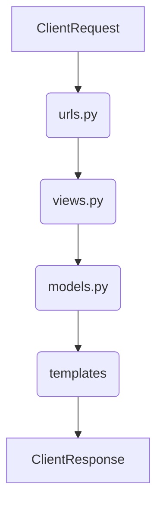

NAMA : Gabriel S. A. Fenanlampir


NPM : 2306315516


JURUSAN : Ilmu komputer 


KELAS : PBP E 


TUGAS 2 : e-shop Alkimia GaVel Shop


link PWS dapat diakses disini: https://gabriel-selwas-tugas2.pbp.cs.ui.ac.id/

Persiapan Lingkungan Pengembangan

Install Python dan pip (Package Installer for Python).
Buat dan aktifkan virtual environment untuk mengisolasi dependensi proyek.
Install Django menggunakan pip: pip install django.
Membuat Proyek Django

Buat proyek baru dengan perintah: django-admin startproject nama_proyek.
Masuk ke direktori proyek dengan cd nama_proyek.
Membuat Aplikasi Django

Buat aplikasi baru dalam proyek dengan perintah: python manage.py startapp nama_aplikasi.
Daftarkan aplikasi di settings.py proyek dengan menambahkannya ke INSTALLED_APPS.
Membuat Model

Definisikan model di models.py dalam aplikasi, misalnya:
```
            <from django.db import models

            <class Artikel(models.Model):
                judul = models.CharField(max_length=100)
                isi = models.TextField()
                tanggal_dibuat = models.DateTimeField(auto_now_add=True)>
                
            <from django.db import models

            <class Artikel(models.Model):
                judul = models.CharField(max_length=100)
                isi = models.TextField()
                tanggal_dibuat = models.DateTimeField(auto_now_add=True)>
```
Migrasi Database

Jalankan perintah python manage.py makemigrations untuk membuat file migrasi.
Terapkan migrasi dengan python manage.py migrate untuk membuat tabel di database.
Membuat View dan URL

Definisikan view di views.py, misalnya:

```
            from django.shortcuts import render
            from .models import Artikel

            def daftar_artikel(request):
                artikel_list = Artikel.objects.all()
                return render(request, 'daftar_artikel.html,{'artikel_list': artikel_list}


            Daftarkan URL di urls.py aplikasi:
            
            <from django.urls import path
            from . import views

            urlpatterns = [
            path('artikel/', views.daftar_artikel, name='daftar_artikel'),
]
```

Buat template HTML di direktori templates, misalnya daftar_artikel.html:

```
                <!DOCTYPE html>
                <html>
                <head>
                    <title>Daftar Artikel</title>
                </head>
                <body>
                    <h1>Daftar Artikel</h1>
                    <ul>
                    
                        <li>{{ artikel.judul }} - {{ artikel.isi }}</li>
                    
                    </ul>
                </body>
                </html>
```

Pengujian dan Deploy

Jalankan server pengembangan dengan python manage.py runserver dan uji aplikasi di browser.
Untuk deployment, gunakan platform seperti Heroku, DigitalOcean, atau lainnya.
*Bagan Arsitektur Web Django*
Berikut adalah bagan sederhana dari request client ke web aplikasi berbasis Django:



Penjelasan:

*urls.py:* Menyediakan rute URL yang mengarahkan request client ke view yang sesuai.


*views.py:* Menangani logika aplikasi, memproses data menggunakan model, dan mengembalikan response dalam bentuk template HTML.


*models.py:* Mengelola data dan interaksi dengan database.


*Templates (HTML):* Menyajikan data yang dikirimkan oleh view dalam format HTML kepada client.


Fungsi Git dalam Pengembangan Perangkat Lunak
Git adalah sistem kontrol versi yang digunakan untuk melacak perubahan dalam kode sumber proyek. Fungsinya mencakup:

                *Versi Kontrol:* Mengelola dan menyimpan versi kode yang berbeda.


                *Kolaborasi:* Memungkinkan banyak developer bekerja pada proyek yang sama secara bersamaan.


                *Branching dan Merging:* Membantu membuat cabang pengembangan terpisah dan menggabungkannya kembali setelah selesai.


                *Histori Perubahan:* Menyimpan riwayat perubahan kode untuk referensi dan pemulihan di masa depan.
                Mengapa Memulai Dengan Django?
                Django adalah framework yang ideal untuk pemula karena:

                        *Dokumentasi Lengkap:* Menyediakan panduan yang komprehensif dan mudah dipahami.
                        *Batteries Included:* Menyediakan banyak fitur bawaan seperti admin panel, autentikasi, dan ORM yang mempermudah pengembangan.
                        *Struktur Proyek Jelas:* Mengikuti prinsip desain yang memudahkan pemahaman alur kerja dan pengembangan aplikasi web.

                        Mengapa Model pada Django Disebut ORM?
                        Model pada Django disebut ORM (Object-Relational Mapping) karena:

                        *Abstraksi Database:* Menghubungkan objek Python dengan tabel database, sehingga developer tidak perlu menulis SQL langsung.
                        *Pengelolaan Data:* Memudahkan operasi CRUD (Create, Read, Update, Delete) dengan menggunakan metode Python standar.
                        *Pemetaan Objek:* Mengonversi data antara format database dan objek Python dengan cara yang transparan.

Q: kenapa kita perlu data delivery dalam mengiplementasi sebuah  pltform?

A: karena 
    1. penyampaian informasi tepat waktu
        ini akan memastikan semua informasi(apapun itu), bisa diakses secara langsung(real-time), berguna untuk pengambilan keputusan cepat dan akurat
    2. konesivitas
        karena platform biasanya terdiri dari banyak komponen, data delivery memungkinkan konektivitas yang baik diantara komponen dan mamstikan bahwa setiap bagian dari platform mendpatkan data yang dibutuhkan.
    3.pengolahan data terdistribusi
        pada platform yang melibatkan terdistribusi, seperti platform berbasis cloud, data delivery sangat penting dalam memastikan sinkronisasi antara berbagai aplikasi. 

Q:  Menurutmu, mana yang lebih baik antara XML dan JSON? Mengapa JSON lebih populer dibandingkan XML?

A:  menurut saya, JSON lebih baik ketimbang XML karena lebih mudah secara penulisan, dan juga punya ukuran data cenderung kecil dibandingkan XML.
alasan mengapa JSON leih populer, karena kesederhanaan dan kemudahan, tentu saja mudah dibaca oleh manusia dan lebih mudah digunakan dalam bahasa pemograman moderen. JSON juga punya kinerha yang baik karena lebih ringan dan lebih cepat untuk di proses. juga JSON lebih populer karena mendapat dukungan luas dari banyak bahasa dan framework yang build-in nya mendukung JSON

Q:  Jelaskan fungsi dari method is_valid() pada form Django dan mengapa kita membutuhkan method tersebut

A:   Method is_valid() pada form Django berfungsi untuk memeriksa apakah data yang dikirimkan melalui form memenuhi semua validasi yang ditentukan. Ini adalah langkah pertama yang harus dilakukan sebelum kita bisa mengakses data yang sudah divalidasi dan diproses melalui form. Jika is_valid() mengembalikan nilai True, artinya data form tersebut valid dan dapat diproses lebih lanjut, seperti disimpan ke database atau digunakan dalam operasi lain.

Q:  Mengapa kita membutuhkan csrf_token saat membuat form di Django? Apa yang dapat terjadi jika kita tidak menambahkan csrf_token pada form Django? Bagaimana hal tersebut dapat dimanfaatkan oleh penyerang?


A: csrf_token di butuhkan untuk melindungi aplikasi dari serangan  CSRF (Cross-Site Request Forgery). CSRF adalah jenis serangan yang mencoba memanipulasi pengguna yang tertautentikasi untuk mengirimkan permintaan palsu ke server tanpa sepengetahuan mereka. tanpa perlindungan ini,aplikasi web menjadi rentan terhadap manipulasi permintaan berbahaya. hal tersebut kemudian memberikan akses atau dimanfaatkan penyerang untuk mengubah data penting dan melakukan transaksi tidak sah dan mengakses data data sensitif.


Q:  Jelaskan bagaimana cara kamu mengimplementasikan checklist di atas secara step-by-step (bukan hanya sekadar mengikuti tutorial).

A: saya mengimplementasinya selain dari tutorial dan juga dari stackoverflow, serta mencari beberapa sumber lain untuk mengimplementasikan checklist


